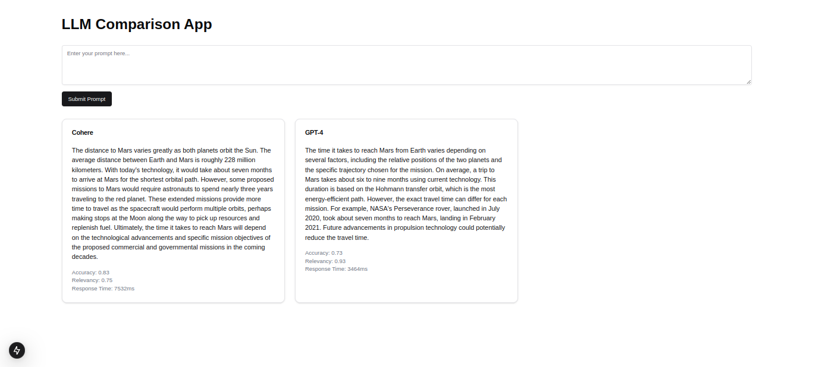
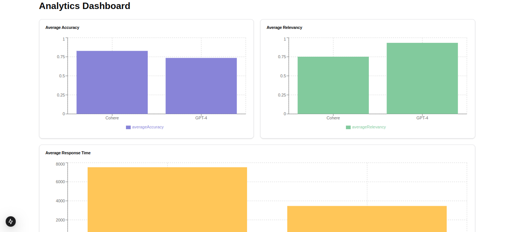

# LLM Evaluation Platform

Goal: Tasked with building an evaluation platform where you test to see what combination of system prompts and LLMs work best for your startup's use case.

## Run Locally

Clone the project

```bash
  git clone https://link-to-project
```

Go to the project directory

```bash
  cd my-project
```

Install dependencies

```bash
  npm install
```

Copy `.env.example` to `.env` and replace with your environment variables

Run to generate the Prisma client based on your schema.

```bash
npx prisma generate
```

Run to push your schema to the database.

```bash
npx prisma db push
```

Start the development server

```bash
  npm run dev
```

Open [http://localhost:3000](http://localhost:3000) with your browser to see the result.

## Screenshots



